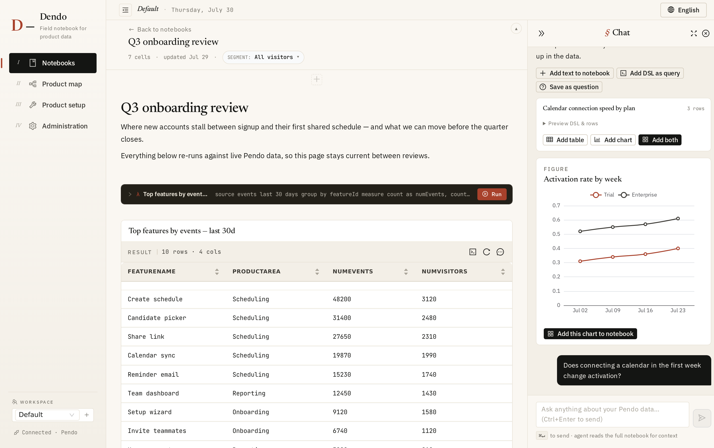
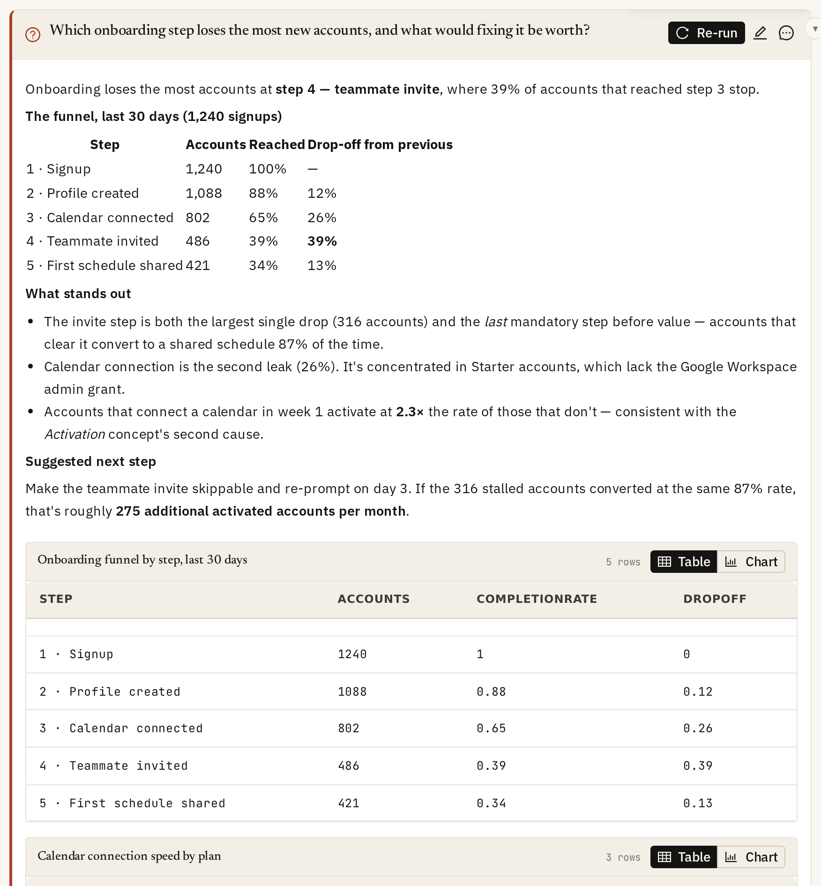
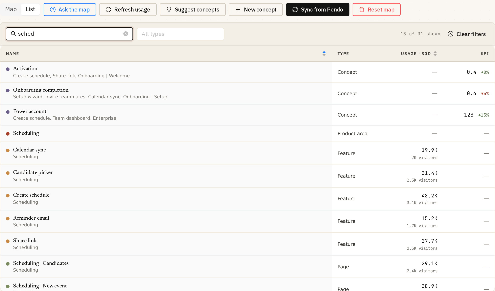
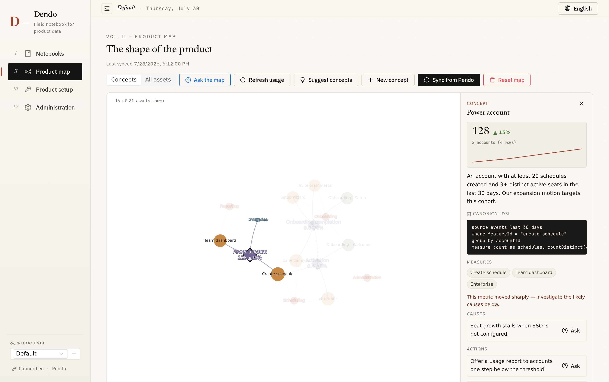
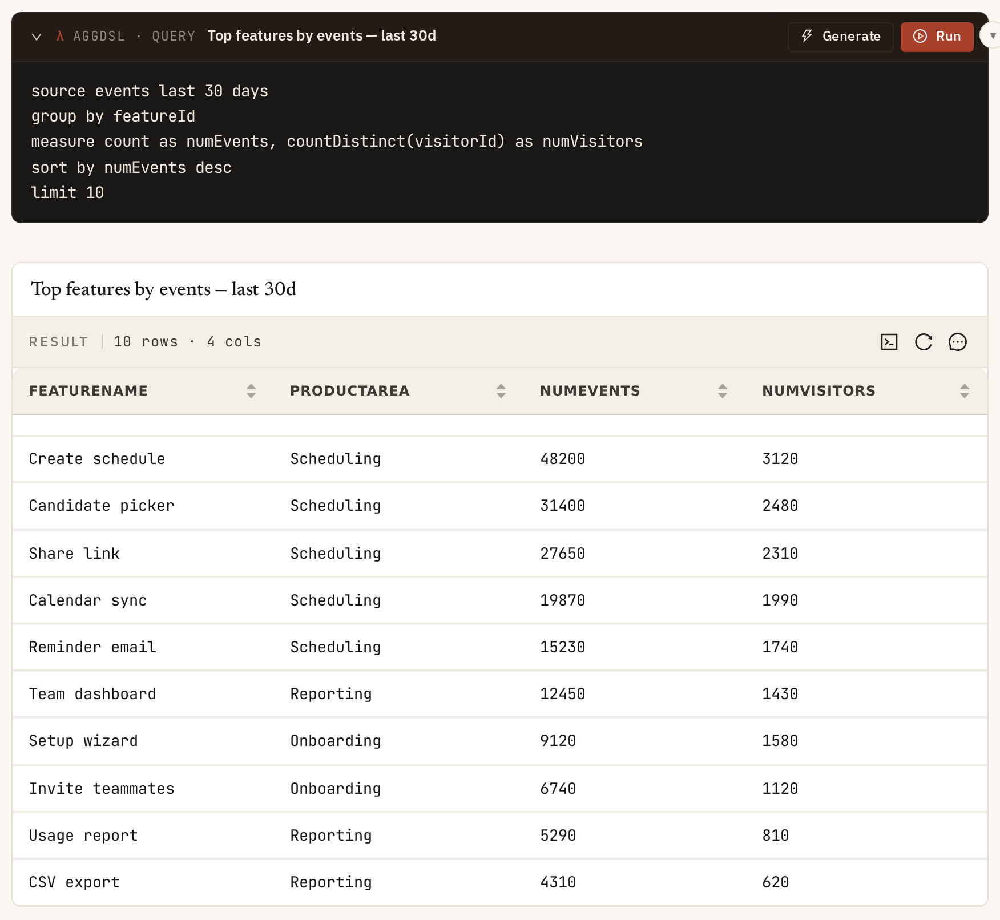
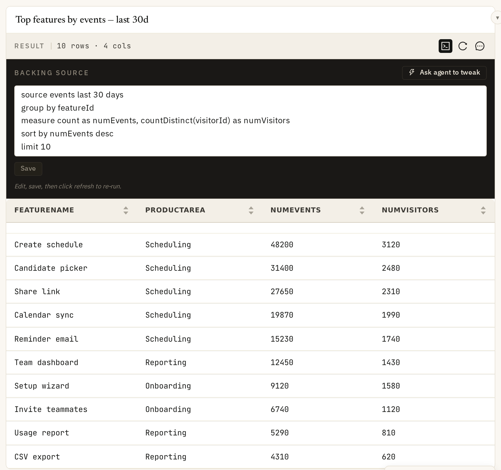
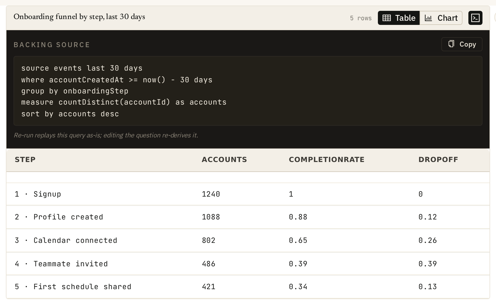
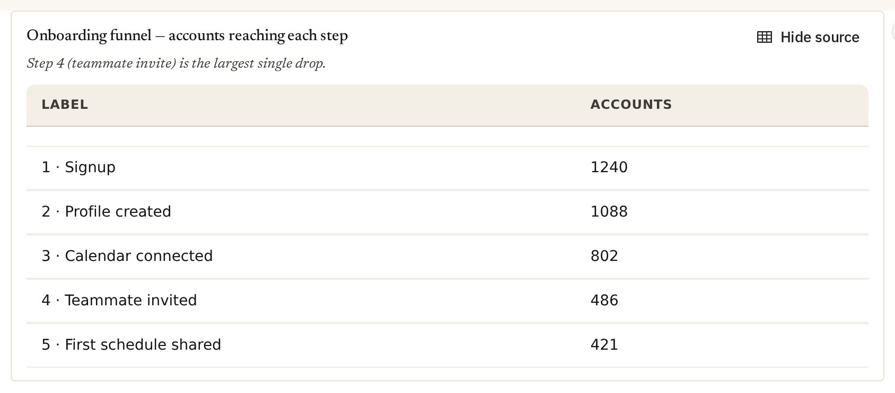
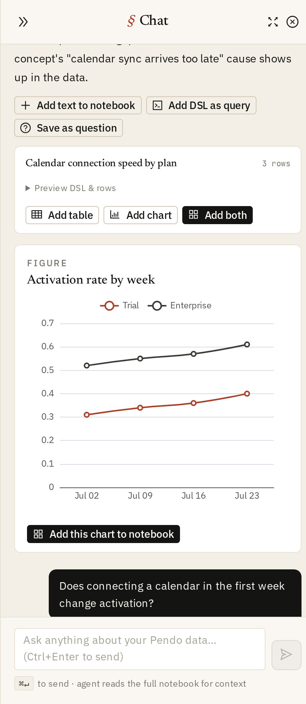
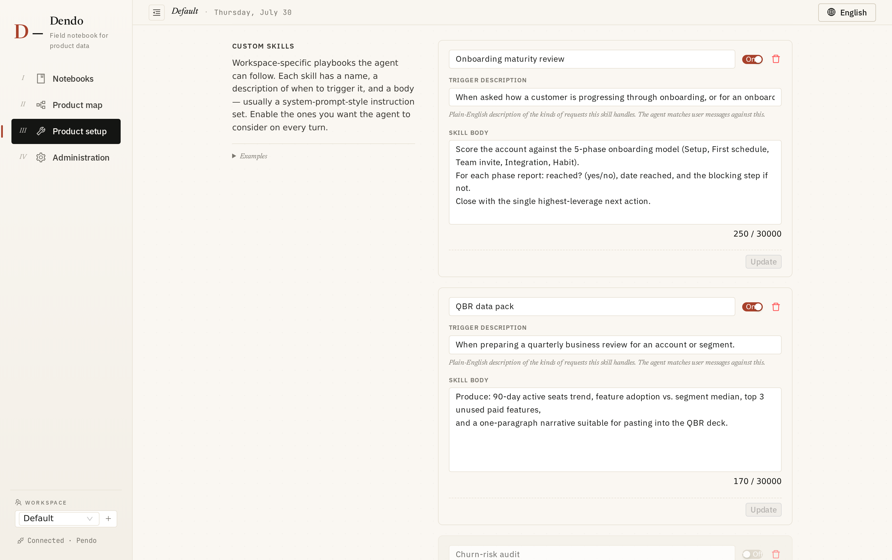

# Dendo

**A field notebook for product data.** Ask questions in plain English, get Pendo aggregations back as notebook cells you can keep, edit, chart — and *re-run*.

> If Pendo were struck by lightning ⚡️ → **Dendo** (電動 — "powered by electricity")

[](https://youtu.be/9qKZRk-hoD0)



> **About the screenshots.** Every screenshot in this README comes from a synthetic demo workspace — invented accounts (Acme, Globex, …), invented features and made-up numbers. No real Pendo data appears anywhere.

---

## The idea

Dendo is a Jupyter-style notebook for product analytics, with an agent sitting at your shoulder. You ask questions in plain English; the agent writes [Pendo aggregation DSL](#the-aggregation-dsl), runs it, and hands back results. You decide what's worth keeping — and the things you keep stay *live*, not frozen.

The left rail is your workspace. The center is the notebook — note, query, table, chart, and **question** cells stacked in order. The right is the agent. Exploration stays in chat; conclusions go on the page.

Alongside the notebooks sits the **Product map** — a living graph of your product's structure (areas, features, pages, segments) with usage painted on and your business definitions pinned to it, so the agent and the humans share one vocabulary.

---

## What's new in v2: re-runnable questions

The earlier version let you save an agent answer as a static cell — a snapshot that went stale the moment the data moved, and was awkward when the agent stitched together several queries into one answer. v2 fixes that with a new kind of cell.

### Question cells — a saved question is the widget, not the snapshot

A **question cell** stores the plain-English question itself and the agent's latest answer, tables, and charts together in one place. Hit **Re-run** and it regenerates — no scrolling back through chat to find what you asked, no re-typing.

Two ways to create one:

- **Save as question** on any chat answer — the cell starts pre-filled with that turn's answer and data.
- **Add question** from the cell menu/toolbar — type the question directly and run it.



### Re-run is deterministic — same queries, fresh data, fresh narrative

The first run lets the agent decide *which* queries to run. After that, the queries are fixed: a **re-run replays those exact DSLs** against Pendo for fresh numbers, then makes a single LLM call to **reinterpret** the latest data against your original question. So the data a question pulls is reproducible run-to-run — only the written answer is regenerated. Cheaper, faster, and stable.

**Rephrasing a question generates new queries.** If you edit the question text and then run it, Dendo detects that the intent has changed and sends it back through the agent to derive fresh queries — not replay the old ones. Hitting **Re-run** with the same question still does the deterministic replay.

A plain query/result/chart cell re-runs *without* the LLM at all — it just re-executes its stored DSL. The question cell is for when the answer itself needs the agent to re-derive it.

### Self-healing when a query goes stale

Schemas drift — a feature gets renamed, an id changes, a query that worked last month 400s today. Instead of answering from half the data, Dendo hands the broken query *back to the agent* along with the **original question**, the query's purpose, the failing DSL, and the error. The agent rethinks the DSL, runs a corrected one, and the fix is saved back onto the cell — so the next re-run replays the healed query deterministically. Queries that work are never touched; the agent is only summoned for the ones that break.

### Reusable across multiple sources

Because a re-run regenerates the *whole* answer, a question that combines several aggregations (one query per persona, per segment, per feature…) stays reusable as a single widget — every source refreshes together, and the agent re-narrates the combined picture.

---

## New: the Product Map — a workspace ontology over Pendo

Pendo's data model is powerful but opaque: cryptic sources, IDs everywhere, and no place to write down what "adoption" or "an active account" actually *means* for your team. The Product Map (nav → **Product map**) fixes that with a lightweight ontology — a typed graph, deliberately not RDF/OWL — in three layers:

### 1. Structure — see the shape of your product

**Sync from Pendo** pulls your product areas, features, pages, and segments and draws them as an interactive force-directed graph. It's auto-synced and never hand-edited, so it can't go stale; re-sync any time and your annotations survive. **Refresh usage** paints the last 30 days of activity onto the map — node size tracks event volume — so the structure and the "heat" live in one picture. Click any node to inspect it.

Two lenses sit above the graph. **Concepts** shows the business layer — concepts, their product areas and the entities they measure — which is the readable default once a workspace has more than a handful of assets. **All assets** drops the filter and draws everything Pendo returned. A counter reports what's on screen (*"16 of 31 assets shown"*) so a filtered view never passes for the whole product.

**The map holds still.** The physics runs once, when the set of nodes changes, and every node is then pinned where it landed. Selecting a node, refreshing usage, or a concept KPI arriving no longer re-shuffles the graph, and starting positions are derived from node ids rather than at random — so a workspace lays out the same way on every visit and you can learn where things live. Drag a node and it stays dragged. The map re-frames itself only when what it's showing actually changes: a lens switch, expanding an area, a sync.

#### List view — when you need to *find* something, not see the shape

A force graph is good at showing structure and bad at answering "where is X?". The **List** toggle swaps the graph for an index of every concept and asset — no lens applied, so nothing is hidden from it. Search matches names, a concept's definition, and the context line (a feature's product area, the entities a concept measures), so *"sched"* finds the *Activation* concept because it measures **Create schedule**. Filter by type, sort by name or 30-day usage, and each row carries its usage and, for concepts, the live KPI and its delta. Click a row and the same detail panel opens as on the map — and if the Concepts lens would have hidden that node, the map widens to **All assets** so switching back doesn't show a panel for something that isn't drawn.



**Reset map** wipes the ontology and rebuilds it from scratch — for when a Pendo re-org makes an incremental re-sync more confusing than starting over.

### 2. Meaning — pin your business definitions as *concepts*

A **concept** is a named business definition — *Activation*, *Power account*, *Onboarding completion* — with:

- a precise prose **definition** (what counts, over what window, for whom),
- an optional **canonical aggDSL query** that measures it (compile-checked on save),
- **links** to the features/pages/segments it's computed from.

Concepts are injected into the agent's system prompt, so asking about a concept by name uses *your* definition and *your* query — the same metric every time, instead of the agent re-deriving (and re-guessing) it per turn. Custom skills still take precedence when both apply.

**A concept carries a live number, not just a definition.** Each one shows a headline KPI with its change against the previous window and a sparkline, computed from the canonical query — or, when there isn't one, from a query derived from the entities the concept measures. The label says which (*"Σ accounts (4 rows)"*), so a number is never mistaken for something it isn't. KPIs are cached hourly and computed per concept: one broken `dslTemplate` degrades that concept to a "KPI unavailable" note instead of taking down the whole map, and a concept whose metric has moved sharply says so and points at its causes.



Don't want to author them by hand? Two paths:

- **Suggest concepts** drafts proposals you review before anything is saved, mining either **the map & data** (usage leaders, busy product areas, high-traffic entities no concept measures yet) or **your conversations** (saved question cells and chat history). Each proposal arrives with the evidence that motivated it, and they stream in one at a time rather than landing in a single batch at the end.
- **Map with AI**, inside the concept editor, drafts the whole concept from a plain-English problem statement — it links the measured objects it can find in the map and proposes causes and actions to edit down.

### 3. Reasons & actions — from a metric to what's next

Each concept carries **causes** (hypotheses for why its metric moves) and **actions** (playbook steps), each with a follow-up question template. One click on **Save as question** drops that question into any notebook as a re-runnable question cell. So "adoption is down" stops being a dead end: walk the causes, run the questions, act on the answers.

### Ask the map

**Ask the map** puts the question box on the graph itself: ask in plain English, and the agent answers using the concepts and structure already on screen, highlighting the nodes its answer touched so you can see which part of the product it reasoned over. Answers save straight into a notebook as re-runnable question cells. When an answer teaches the agent something new about a concept, that concept can absorb it — picking up causes and actions it didn't have before.

---

## The notebook

A notebook is an ordered stack of cells:

| Cell | What it is | Re-run behavior |
| --- | --- | --- |
| **Note** | Free-form markdown commentary | — |
| **Query** | A *named* aggDSL query you (or the agent) wrote | **Run** executes the DSL and refreshes its own result table — no LLM |
| **Result** | A table of returned rows, owned by one query | **Refresh** re-runs its backing DSL — no LLM |
| **Chart** | Line / bar / donut, single- or multi-series | **Refresh** re-runs each series' DSL — no LLM |
| **Question** | A saved plain-English question + its answer/tables/charts | **Re-run** replays saved DSLs (repairing stale ones) + LLM reinterprets |

### Name a query; its table is a pair, not a pile

Give a query cell a name and the name travels: the result table underneath carries the same heading, so a table halfway down a long notebook still says which question produced it. Click the name to rename it in place — the table's heading follows immediately, with no re-query.

A query owns exactly **one** result table for the life of the cell. Re-running replaces the rows in place instead of appending another snapshot below, so a notebook you refresh weekly doesn't grow a stack of near-identical tables with no way to tell which run each came from. Column order you set by hand survives the refresh, and a query that grows a new field shows it rather than hiding it.



Every result and chart cell exposes the **backing source** — edit the DSL, save, refresh. Or click **Ask agent to tweak** to negotiate the change in chat. Result tables support column drag-to-reorder and sortable headers.



Each table inside a question cell exposes its query too. The code toggle in a result's header opens the **backing source** — the exact aggDSL the agent ran for that result — with one-click **Copy**. A question can combine several sources, so each gets its own panel and you can see precisely which query produced which table. It's read-only here, unlike a result cell: a question's queries are derived from its text, so rephrasing the question replaces them. To take ownership of one, copy it into a query cell.



Agent-built **summary charts** in question cells include a **Show source** toggle that switches between the chart and the flat data table behind it, so you can inspect or copy the raw numbers.



Tables inside question cells render **readable dates** and resolve Pendo ids to **real page and feature names**, so a saved answer stays legible without cross-referencing anything.

### From chat to notebook

Every agent answer carries action buttons: **Add text**, **Add DSL as query**, **Add table**, **Add chart**, **Add both**, or **Save as question**. Nothing lands in the notebook until you say so.



### Custom skills — workspace playbooks the agent always knows

Skills are reusable, system-prompt-style playbooks scoped to a workspace: your adoption scorecard, your QBR template, your churn-risk audit. The agent matches each incoming question against every skill's trigger description and applies the relevant ones automatically.



Sample skill shipped with the repo: [`.github/skills/pendo-agg/SKILL.md`](.github/skills/pendo-agg/SKILL.md) — turns a plain-English analytics question into a Pendo aggregation, fetches it, and summarizes or charts the result.

---

## Prerequisites

- **Node** 22 — pinned in `.nvmrc`; `./dev.sh` installs/selects it via nvm
- **Python** 3.10+ — the repo pins `3.14` in `.python-version`; `./dev.sh` installs it with pyenv
- A **Pendo Integration API key** and **app ID**
- An **LLM provider** key — OpenAI, Anthropic, or Azure OpenAI

## Run it

One command sets up both runtimes (pyenv + venv + Python deps, then nvm + Node + web deps) and starts the app:

```bash
./dev.sh
```

Prefer to drive the web app yourself? The Python toolchain (`aggdsl` on PATH, `tools.pendo` importable) just needs to be installed first — `pip install -e ".[tools,dev]"` from the repo root — then:

```bash
cd apps/web
npm install
npm run dev
```

App runs at `http://localhost:3000`. The app walks you through setup on first run.

---

## Setup

### 1. Pendo connection — `Admin → Pendo Configuration`

- **API Key**: Pendo → Settings → App Details → Aggregation → API Keys (use an **Integration** key)
- **Default appId**: your application's id — in multi-app subscriptions entity lookups and the Product map are scoped to this app
- **API Endpoint**: e.g. `https://app.pendo.io/api/v1/aggregation`

Click **Test Connection** to validate the key against Pendo (`/token/verify`) before relying on it.

### 2. LLM provider — `Admin → Providers`

| Provider | What you need |
| --- | --- |
| OpenAI | API key |
| Anthropic | API key |
| Azure OpenAI | API key, endpoint, deployment, API version (e.g. `2024-10-21`) |

Click **Test Connection** to verify.

### 3. Agent — `Admin → Agents`

Create at least one: pick a provider, pick a model (fetched live), and optionally a system prompt every conversation in this workspace should respect.

### 4. Workspace instructions — `Setup → Tell the agent what it should always know`

Free-form, plain English. Pricing tiers, North Star metrics, accounts to ignore, naming quirks, response style — anything you'd otherwise repeat in every chat. Re-read every turn, so edits take effect immediately.

### 5. Custom skills — `Setup → Custom skills` *(optional)*

Each skill has a name, a trigger description (when should the agent reach for this?), and a body. Toggle individual skills on/off per workspace.

### 6. Product map — `Product map → Sync from Pendo` *(recommended)*

One click builds the structural graph from your Pendo features, pages, and segments. Then add (or **Suggest**) concepts so the agent inherits your business definitions. Re-sync whenever your product structure changes — concepts are preserved.

### 7. MCP servers — `Admin → MCP Servers` *(optional)*

Connect external tool servers over **streamable HTTP** — the session handshake and SSE-framed responses that servers like Pendo's own MCP endpoint expect, as well as plain JSON-RPC. **Test Connection** and the auth flow use the saved server config, so what you test is what the agent will use. The agent can call their tools alongside the built-in Pendo queries.

### 8. General — `Admin → Settings`

- **Max Tokens** per response (default ~4000; bump for long analyses).
- A notebook-level **default segment** can be set from the notebook header — it's applied to every aggregation (cells *and* chat) unless a query overrides it.

---

## A typical session

1. **New notebook**, give it a title.
2. Ask in the agent bar: *"Top 10 features by event count last 30 days"*, *"Which accounts are most active this week?"*, *"Adoption rate for the new dashboard, per persona."*
3. The agent writes aggDSL, runs it, and surfaces results in chat.
4. Keep what matters with the per-message buttons — push a table/chart in, or **Save as question** so you can re-run it later.
5. Edit any cell's DSL inline and refresh. Add notes for commentary, query cells to write DSL directly.
6. Notebooks save automatically.
7. When a metric needs explaining, open the **Product map**: check the concept's definition, walk its causes, and save the follow-up questions straight into your notebook.

Tip: the **fullscreen chat** toggle (top-right of the sidebar) hands you the whole canvas for long iterative sessions before you're ready to commit anything.

---

## Architecture

A Nuxt 3 web app (`apps/web`) over a Python aggregation toolchain (`src/`, `tools/`). The web server shells out to the toolchain to compile and run DSL; the agent uses the same path as manual cell runs, so chat results and cell results are identical in shape.

### Web APIs (`apps/web/server/api`)

**Notebooks & cells**
- `/api/notebooks` · `/api/notebooks/[id]` — CRUD
- `/api/notebooks/[id]/cells` — cell management
- `/api/notebooks/[id]/run-query` — execute a cell's DSL (compile → run → enrich → flatten)

**Agent & questions**
- `/api/notebooks/[id]/agent/stream` — streaming chat responses (SSE)
- `/api/notebooks/[id]/chat/list` · `/chat/clear` — chat history
- `/api/notebooks/[id]/question/run` — first run of a question cell (agent derives the queries)
- `/api/notebooks/[id]/question/rerun` — deterministic re-run: replay saved DSLs, repair stale ones, LLM reinterprets

**Ontology (Product map)**
- `/api/ontology` — full graph (structural + concept nodes, derived edges)
- `/api/ontology/sync` — rebuild the structural layer from Pendo (atomic, concept-preserving)
- `/api/ontology/overlay` — 30d usage per feature/page (cached 1h, partial-failure tolerant)
- `/api/ontology/concepts` (+ `/[id]` DELETE) — concept upsert/delete (DSL templates compile-checked)
- `/api/ontology/suggest` — LLM-drafted concept proposals mined from question cells + chat (review-only, never auto-saved)

**Runtime**
- `/api/aggregation/compile` — DSL compilation (`aggdsl compile`)
- `/api/aggregation/run` — query execution (`python -m tools.pendo.run_agg`)

**Admin**
- `/api/admin/providers` (+ `/test`) · `/api/admin/agents` · `/api/admin/pendo` · `/api/admin/mcp` · `/api/admin/settings`

**Agent Analytics**
- `/api/pendo/reaction` — record a thumbs-up/down against an agent answer (see below)

### Pendo Agent Analytics

Every agent turn is reported to [Pendo Agent Analytics](https://app.pendo.io) via `pendo-server-sdk`: the user's prompt, the agent's answer, and the trace behind it (each LLM generation and each tool call, with token counts and error status). Instrumentation lives in `server/utils/pendoTracing.ts`.

**The DSL toolchain is traced too.** `aggdsl` is reported as its own `aggdsl_compile` tool call, nested inside the agent tool that invoked it, so a trace shows the compile step rather than just its end result:

```
conversation.turn
├─ user.prompt                     "which features did enterprise accounts adopt?"
├─ llm.generation                  claude-sonnet-4 · 1200 in / 80 out
├─ tool.run_pendo_aggregation
│  └─ tool.aggdsl_compile          in:  the DSL the agent wrote
│                                  out: the compiled Pendo aggregation body
└─ agent.response                  answer · tools used · token rollup
```

`tool.input` carries the DSL as the agent wrote it, plus the `effectiveDsl` that `aggdsl` actually received when normalization or default-segment injection changed it. `tool.output` carries the compiled Pendo body, or the compiler's error text when a compile fails — which is what makes a bad generated query legible in the trace. Compiles served from `dslCache` never reach the subprocess and are stamped `aggdsl.from_cache` so the trace doesn't imply a run that didn't happen.

Turns are reported from the four surfaces that actually run the agent:

| Surface | Conversation id | Notes |
| --- | --- | --- |
| Notebook chat (`/agent/stream`) | `nbchat:<uuid>`, stored with the messages | The one multi-turn thread — see below |
| Question cell run (`/question/run`) | `qcell:<sessionId>` | Deliberately stateless: one conversation per run |
| Question cell re-run (`/question/rerun`) | `qrerun:<notebookId>:…` | Prompt is the *original* question; DSL repair shows up as nested trace spans |
| Product map ask (`/ontology/ask`) | `ask:<sessionId>` | One-shot ask, one conversation |

**The notebook chat's conversation id lives in the database, beside the messages** (`chat_conversation:<notebookId>` in `kv_store`), not in the browser. The client's `sessionId` is regenerated on every page load, so keying off it would split one continuous chat into a new conversation each time the user reloaded or navigated back. Instead the id is minted on the first turn and stays fixed for the life of the visible thread — across reloads, and across browsers looking at the same notebook.

Clearing the chat retires it: `clearChatMessages()` rotates the id in the same call that deletes the messages, so the analytics conversation always ends exactly when the thread the user can see does. Each notebook keeps its own id; clearing one never touches another.

Background LLM work that isn't part of a conversation (concept evolution, concept suggestions, entity mapping) is deliberately **not** reported — it would otherwise attach stray generations to whichever conversation ran last.

Configuration is in `nuxt.config.ts` under `runtimeConfig.pendoAgent`, with working defaults.

| Setting | Default | Dev / build-time var | **Production runtime var** |
| --- | --- | --- | --- |
| Public App ID | *(pre-filled)* | `PENDO_AGENT_API_KEY` | `NUXT_PENDO_AGENT_API_KEY` |
| Agent ID | *(pre-filled)* | `PENDO_AGENT_ID` | `NUXT_PENDO_AGENT_AGENT_ID` |
| Ingestion host | `https://app.pendo.io` | `PENDO_AGENT_ENDPOINT` | `NUXT_PENDO_AGENT_ENDPOINT` |
| Tracing on/off | `true` | `PENDO_AGENT_TRACING=false` | `NUXT_PENDO_AGENT_ENABLED=false` |
| PII redaction | `false` | `PENDO_AGENT_REDACT=true` | `NUXT_PENDO_AGENT_REDACT=true` |
| Visitor override | *(empty)* | `PENDO_AGENT_VISITOR_ID` | `NUXT_PENDO_AGENT_DEFAULT_VISITOR_ID` |
| Account override | *(empty)* | `PENDO_AGENT_ACCOUNT_ID` | `NUXT_PENDO_AGENT_DEFAULT_ACCOUNT_ID` |

The Public App ID is the same public value a browser Pendo snippet carries, not a secret token — which is why it ships as a default. The Agent ID comes from Product → Agent Analytics → settings.

> **Two columns, because they apply at different times.** The plain `PENDO_AGENT_*` names are read by `nuxt.config.ts`, so they are baked in when `nuxt build` runs — perfect for `.env` in dev, but setting them on a built server does nothing. In production use the `NUXT_`-prefixed names, which Nuxt maps onto `runtimeConfig` at startup. Both forms are verified working.

**Identity.** Dendo has no end-user login, so the visitor is workspace-derived rather than per-person: the workspace's slug suffixed with `_user_turn` — workspace *Acme Corp* reports as `acme-corp_user_turn`, the default workspace as `default_user_turn`. (Workspace is the user-facing name for an Organization, the entity behind `orgId` and the `X-Org-Id` header. The slug is used rather than the display name because it's already URL-safe.)

Full precedence — visitor: `x-pendo-visitor-id` header → `PENDO_AGENT_VISITOR_ID` → `<workspace-slug>_user_turn`. Account: `x-pendo-account-id` header → `PENDO_AGENT_ACCOUNT_ID` → the resolved org id. Once real users exist, send the header from whatever shell embeds Dendo — no server change needed.

**User interactions.** Prompts, answers, and traces are emitted automatically; anything the user *does* with an answer has to be sent explicitly. The chat sidebar's action buttons are wired to `POST /api/notebooks/[id]/chat/interaction`, which reports the click as a Pendo `user_reaction` against that answer:

| Button | Action reported |
| --- | --- |
| Add text to note | `add_note` |
| Add DSL as query | `add_query` |
| Save as question | `save_question` |
| Add table / chart / both | `add_aggregation` (mode in the comment field) |
| Add this chart to the notebook | `add_chart` |

Together these say which answers were good enough to keep — a signal that is otherwise invisible.

Pairing works because the agent stream mints the assistant message's id *before* the turn and uses it in three places: the chat row, the message the UI renders, and Pendo's `agent_response`. One id everywhere means a click attributes to the exact answer. The conversation id is resolved server-side from the notebook, so the browser never handles analytics identifiers. Calls are fire-and-forget — a failed analytics write never blocks or fails the user's click.

> These use action-specific reaction types rather than Pendo's documented `thumbs_up` / `thumbs_down` / `unreact`. They transmit and store correctly (verified end to end), but Pendo's Agent Analytics UI may only give first-class treatment to the standard set — check how they surface before relying on them for reporting.

**Thumbs up/down** is not wired: there's no feedback control in the chat UI. `POST /api/pendo/reaction` is ready for one whenever it's built.

### The aggregation DSL

`aggdsl` (in `src/aggdsl`) is a small DSL that compiles to Pendo Aggregation API JSON bodies, exposed as a CLI (`aggdsl compile`) and used by the web runtime. Execution helpers live in `tools/pendo` (`run_agg`, `lookup_names`, `lookup_segments`, …). Make sure Python deps are installed, `aggdsl` is on PATH, and `tools.pendo` is importable.

---

## Troubleshooting

| Symptom | Fix |
| --- | --- |
| *"Pendo API key not configured"* | Admin → Pendo Configuration. Use an **Integration** API key. |
| *"No providers configured"* | Admin → Providers → **Test Connection**. |
| *"No agents configured"* | Admin → Agents. Pick a provider + model. |
| A question re-run says it *rebuilt* a query | A saved DSL went stale and the agent repaired it — the fix is saved on the cell. Check the backing source if the answer looks off. |
| Product map is empty | Run **Sync from Pendo** (needs the Integration key). Concepts work even before a sync. |
| Product map shows *"entity list truncated"* | Large workspace — sync caps at 300 features / 300 pages / 100 segments to keep the graph readable. |
| Concept saved with a *DSL warning* | The concept stored fine, but its canonical query doesn't compile — fix it before the agent starts preferring it. |
| A concept shows *"KPI unavailable"* | That concept's canonical query failed; the rest of the map is unaffected. Fix its `dslTemplate`, or clear it and let the KPI fall back to a query derived from the entities it measures. |
| Concept KPIs look stale | They're cached for an hour. **Refresh usage** recomputes the overlay and the KPIs together. |
| A query cell keeps making new tables | Result cells created before query→result pairing existed have no owner. The next run adopts the orphan directly beneath the query when its DSL matches; otherwise delete the stray table and re-run. |
| Response is cut off | Admin → Settings → bump Max Tokens, or ask the agent to continue. |
| Agent ignores a rule you mentioned once | Move it into Setup → workspace instructions (re-read every turn). |
| Nothing in Pendo Agent Analytics | Conversations batch hourly — allow ~15 min after the next batch starts. Then check tracing isn't disabled, that the Agent ID matches the one in Pendo, and that outbound traffic to `app.pendo.io/data/agenticsdk/*` is allowed. |
| Env var changes have no effect in production | Plain `PENDO_AGENT_*` vars are build-time only. On a built server use the `NUXT_`-prefixed names (see the config table above). |
| Traces appear but token counts are empty | Anthropic reports usage inline on the stream; OpenAI-protocol deployments only do when they opt into usage-on-stream. Everything else still reports. |

---

## Screenshots

All screenshots live in [`docs/screenshots/`](docs/screenshots) and are embedded in the sections above:

| Shot | Shows |
| --- | --- |
| [`notebook-overview.png`](docs/screenshots/notebook-overview.png) | A notebook with note, query, result and question cells, agent sidebar open |
| [`query-cell-named.png`](docs/screenshots/query-cell-named.png) | A named query cell above the single result table it owns |
| [`result-cell-source.png`](docs/screenshots/result-cell-source.png) | A result cell with the **Backing source** DSL panel expanded |
| [`question-cell.png`](docs/screenshots/question-cell.png) | A saved **question cell** — question, **Re-run**, answer, tables |
| [`question-cell-dsl.png`](docs/screenshots/question-cell-dsl.png) | A question cell result with its read-only **Backing source** aggDSL open |
| [`question-cell-source.png`](docs/screenshots/question-cell-source.png) | A summary chart with **Show source** toggled open |
| [`chat-actions.png`](docs/screenshots/chat-actions.png) | An agent answer with the **Add table / Add chart / Save as question** buttons |
| [`product-map.png`](docs/screenshots/product-map.png) | The **Product map** with a concept selected: KPI, definition, causes, actions |
| [`product-map-list.png`](docs/screenshots/product-map-list.png) | The Product map's **List** view, filtered — every concept and asset, searchable |
| [`custom-skills.png`](docs/screenshots/custom-skills.png) | **Custom skills** on the Product setup page |

They're captured from a synthetic demo workspace, not a live Pendo account — the accounts, features, pages and numbers are invented, so nothing here reveals a real customer's data.
